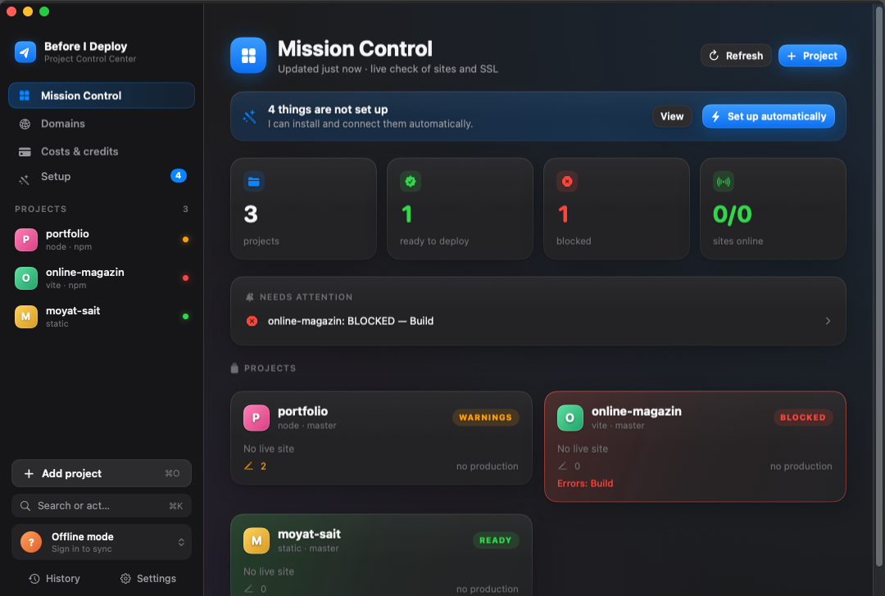

# Before I Deploy

**Check, fix and publish your websites from one Mac app.** Before I Deploy looks at a project the way a
careful senior developer would before a release — Git, secrets, dependencies, lint, types, build, hosting —
tells you in plain words what is wrong, proposes the fix (with AI when you want it), and only then publishes
a draft or production.

Native SwiftUI app for macOS 13+, English and Bulgarian. *(На български — по-долу.)*



## Install

1. Download **Before I Deploy.dmg** and drag the app to **Applications**. One universal app for Apple
   silicon and Intel, signed and notarized.
2. Open it. The engine inside the app installs itself; if **Node.js 18+** is missing, the app shows where to
   get it (`brew install node` or nodejs.org) and checks again.
3. Add a project folder (⌘O) — or try the sample project on the first screen.

Updates appear in the sidebar and can be installed with one click; the app never needs Terminal.

## What it does

- **Mission Control** — every project at a glance: ready / warnings / blocked, uptime, SSL, domains, costs.
- **Check** (⌘R) — Git → Secrets → Dependencies → Lint → Typecheck → Build → Hosting. Unchanged steps are
  reused, so a second check takes seconds; ⌥⌘R runs everything.
- **Automatic check** — watches the project folder and re-checks after you save; tells you only when the
  verdict changes.
- **Smart Deploy** (⌘D) — check → draft on Netlify (or Vercel, Cloudflare Pages, GitHub Pages). Production
  needs `DEPLOY` typed and a fresh check of exactly the code that is on disk.
- **AI Fix** — explains the failure and proposes file changes as diffs; nothing is written until you apply
  them, and applying is all-or-nothing. Plans with credits, or your own Anthropic / OpenAI key.
- **Local Preview**, **GitHub** (commit & push chosen files), **domains** (Spaceship DNS → Netlify),
  **history**, **notifications**, a **menu bar** icon, ⌘K command palette.
- **Account** (optional) — sync across Macs, plans & credits via Paddle, export or delete your data any time.

Keys for Netlify, GitHub, Vercel and AI providers stay in your Mac's Keychain. Your code is never uploaded
except the log and files you choose to send to AI Fix (you are asked once).

## For developers

```zsh
git clone … && cd beforeideploy
zsh scripts/install.sh          # checks the tools, installs the engine, runs the tests, builds into /Applications
zsh Rebuild.command             # after a change: rebuild and reopen
```

| Part | Where | Tests |
|---|---|---|
| App (SwiftUI, Swift Package, Command Line Tools only) | `App/` | `cd App && swift test` |
| Engine `bid` (Node 18+, no dependencies, NDJSON) | `engine/` | `node tests/run.mjs` |
| Cloud (Supabase: Postgres + RLS, Deno Edge Functions) | `supabase/` | `deno test supabase/functions` |

Every app action goes through `bid`, which you can use in Terminal too:

```zsh
BID="$HOME/Library/Application Support/BeforeIDeploy/engine/bid"
"$BID" check --project ~/Sites/my-site
"$BID" smart --project ~/Sites/my-site --prod --confirm DEPLOY
"$BID" help
```

Exit codes: 2 = missing confirmation / bad arguments, 3 = blocked or no fresh check, 4 = hosting not linked,
5 = not signed in. Every error code is in [`docs/errors.md`](docs/errors.md). A line containing
`bid-ignore` is skipped by the secrets scanner.

CI (`.github/workflows`): engine on Linux and macOS, `swift build` + `swift test` + a bundle check, `deno check`
+ `deno test`, localization and error-code checks, and real screenshots from a macOS runner.

**Data:** library, state and history in `~/Library/Application Support/BeforeIDeploy/`, logs in
`~/Library/Caches/BeforeIDeploy/`. **Remove:** `zsh scripts/uninstall.sh` (keeps your library) or
`--all` (also history, settings and the saved Keychain items; project folders are never touched).

**Documents:** [`docs/AUDIT-V10.md`](docs/AUDIT-V10.md) — the release audit and its status ·
[`docs/release.md`](docs/release.md) — signing, notarization, update feed, legal pages ·
[`supabase/functions/README.md`](supabase/functions/README.md) — cloud setup · [`CHANGELOG.md`](CHANGELOG.md) ·
[`ROADMAP.md`](ROADMAP.md) · [`docs/manual-qa.md`](docs/manual-qa.md).

---

## На български

**Before I Deploy** проверява проекта ти преди публикуване — Git, тайни, зависимости, lint, типове, build,
хостинг — казва на разбираем език какво не е наред, предлага поправка (и с AI) и чак тогава публикува
чернова или production.

- **Инсталация:** изтегли DMG-то и премести приложението в **Applications**. Engine-ът се инсталира сам;
  ако липсва Node.js 18+, приложението показва откъде да го вземеш. Обновленията се появяват в страничната
  лента.
- **От изходния код:** `zsh scripts/install.sh`, след промяна — `zsh Rebuild.command`.
- Ключовете остават в Keychain на твоя Mac. Кодът ти не се качва никъде, освен лога и файловете, които сам
  изпратиш към AI поправката (питам веднъж).
- Премахване: `zsh scripts/uninstall.sh` или `--all` за всичко.
