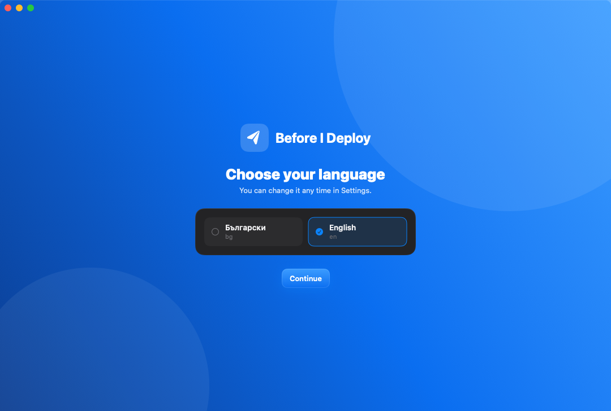
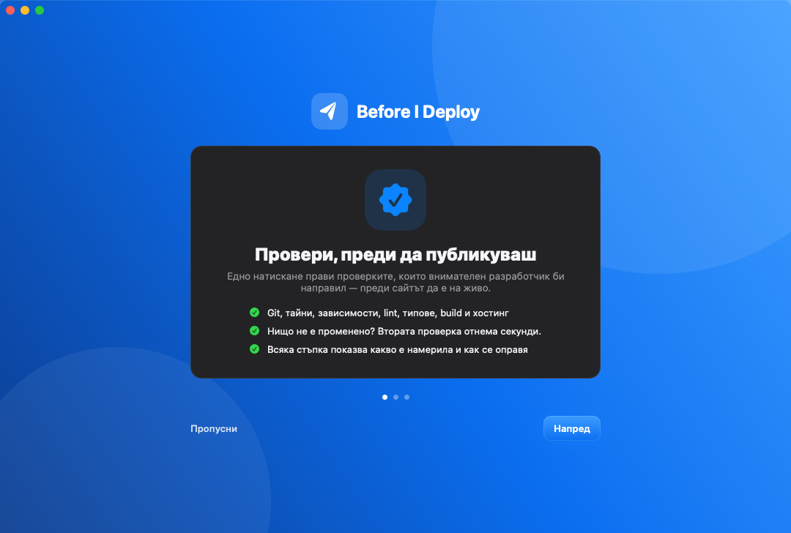
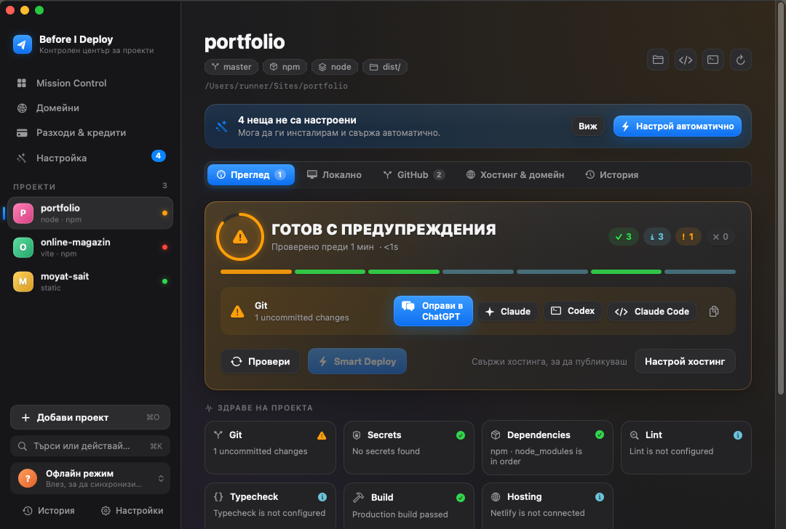
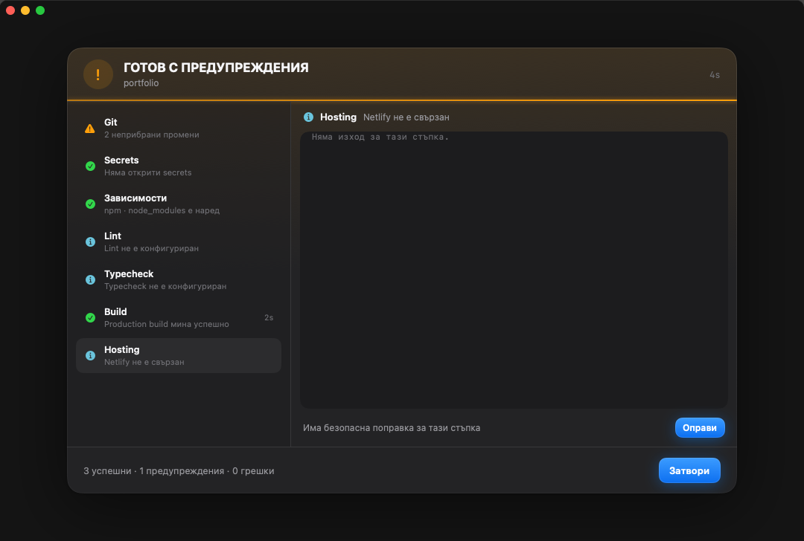
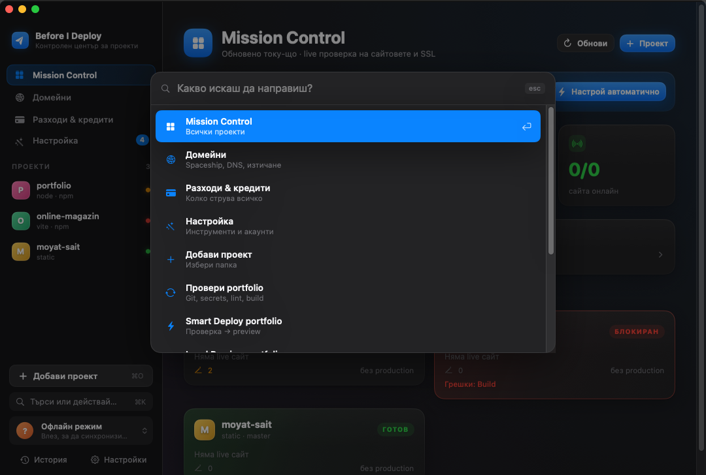
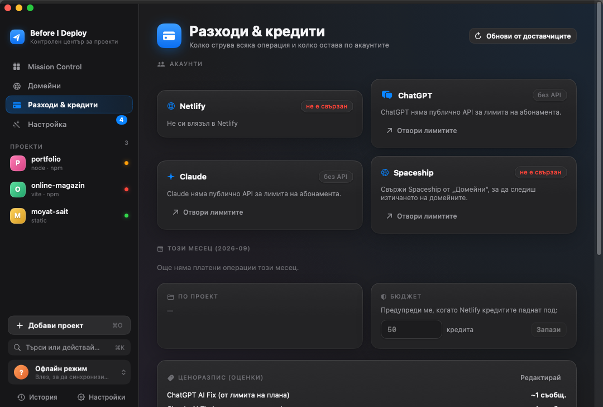
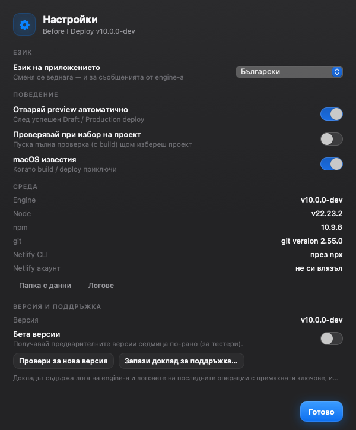
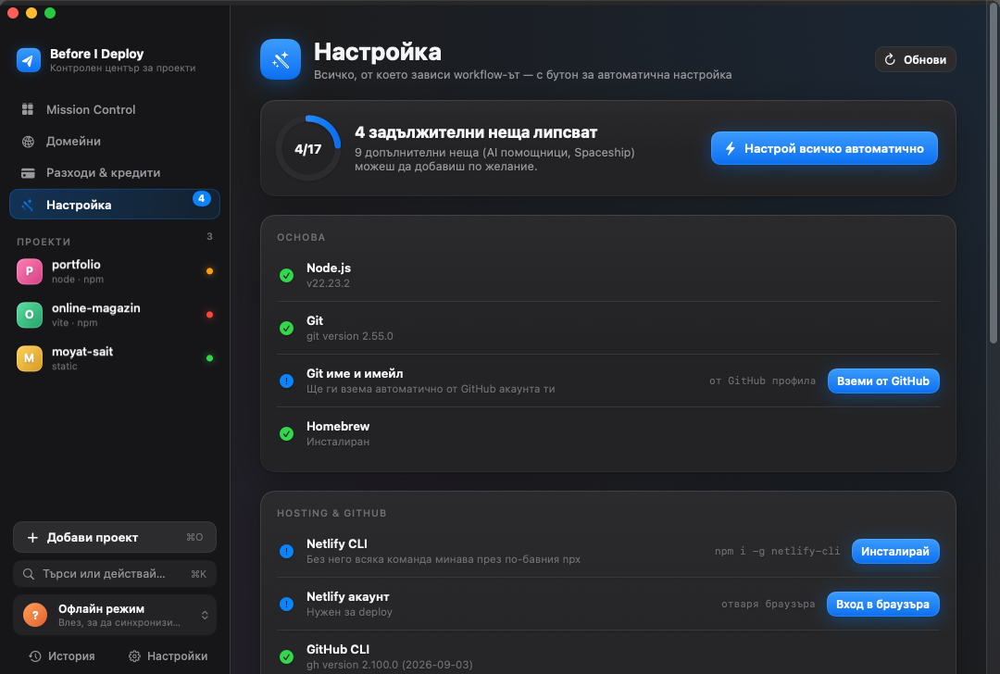

# Before I Deploy V10 — екрани

Истински снимки от macOS (GitHub Actions, macos-15) с три демо проекта. Нови снимки при всяка промяна в
`App/**`: workflow `screenshots`, клон `claude/nifty-edison-1195gi-screenshots`.

| | |
|---|---|
|  Избор на език |  Тур при първо пускане |
|  Mission Control |  Проект |
|  Проверка |  Палитра ⌘K |
|  Разходи |  Настройки |
|  Настройка | |
